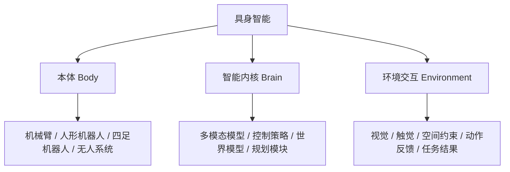

# Task 01: 理论与趋势

## 1. 本节你要建立什么认知

完成这一节后，你至少应该能回答下面三个问题：

1. 具身智能和普通的聊天大模型有什么根本区别？
2. 为什么机械臂、人形机器人、自动驾驶、四足机器狗都可以放进同一个讨论框架？
3. 当前具身智能最核心的机会和最现实的难点分别是什么？

## 2. 什么是具身智能

可以先用一句最容易记住的话来理解：

> 具身智能 = 能在物理世界里感知、理解、决策并行动的智能系统。

和只在屏幕中处理文字、图像、语音的 AI 相比，具身智能多了一层非常关键的约束：它必须面对真实世界。真实世界不是纯文本环境，它有空间、时间、摩擦、遮挡、碰撞、延迟、误差和失败成本。

这也是“具身”二字最核心的含义。它不等于“长得像人”，而是指系统有一个能够和世界发生真实交互的载体。这个载体可以是：

- 机械臂
- 双足或轮式人形机器人
- 四足机器人
- 无人车、无人机、无人船
- 搭载 AI 的工业装备

## 3. 具身智能的三个核心要素

### 3.1 本体

本体决定了系统“能做什么动作”。机械臂擅长抓取和操作，人形机器人更适合复杂空间中的移动与双手协同，无人车更擅长导航和运输。

### 3.2 智能内核

智能内核决定了系统“如何理解和决策”。它可能包含感知模型、VLA、世界模型、规划模块、控制器等。

### 3.3 环境交互

环境交互决定了系统“能否真正落地”。纸面上看起来很简单的动作，一旦放进真实环境，就会遇到光照变化、视角遮挡、抓取误差、延迟累积等问题。

这也是具身智能和纯软件智能最大的区别之一。

## 4. 为什么现在大家都在讨论具身智能

过去一年，具身智能在运动场上实现运动能力突破，在训练场中学习作业技能，为真实场景应用打下基础。产业整体展现出**“融合”“多元”“繁荣”**的发展特点：

1. **聚焦实现软硬、知行和虚实融合**：推进软硬融合创新，加速具身基础模型和本体结构的软硬协同进化；关注知行合一，打造感知决策行动一体化的闭环链路；打通虚实贯通路径，推动从仿真模拟到现实实践的迁移和部署。
2. **打造“上天入海涉险”多元化产品**：各类硬件载体从单一用途到多用功能，从结构化环境到非结构化自然环境，呈现明显的智能化突破：
   - **移动类产品（解决“去哪里”问题）**：四足、多足、轮足机器人；无人车、无人机、无人船等。
   - **操作类产品（解决“干什么”问题）**：协作机械臂、复合轮臂式机器人、人形机器人（双足/轮式）等。
3. **产业生态体系不断完善**：行业应用、产品服务、技术服务和基础设施四大板块逐步形成完整产业链。其应用前景广阔，涉及“工具”“用具”“载具”“玩具”等多种类型，有望成为智慧员工、生活助手、智驾司机和智能伙伴。

过去几年，大模型把“理解”和“生成”推得很快，但真正高价值的很多任务并不发生在聊天框里，而发生在物理世界里，例如：

- 工厂里的分拣、装配、搬运
- 家庭里的整理、递送、陪伴
- 仓储物流里的拣选、转运、上架
- 危险环境下的巡检、救援、勘探

从这个角度看，具身智能的意义不只是让机器人更聪明，而是把 AI 从数字空间带入现实空间。

## 5. 具身智能有哪些常见形态

可以把它们粗略分成两类：

### 5.1 移动类载体

它们主要解决“去哪里”的问题。

- 无人车
- 无人机
- 四足机器人
- 轮足机器人

### 5.2 操作类载体

它们主要解决“干什么”的问题。

- 协作机械臂
- 双臂机器人
- 人形机器人
- 轮臂复合机器人

很多现实系统会同时具备这两类能力，也就是“会移动”加“会操作”。

## 6. 当前行业为什么既火热又困难

具身智能被视为实现通用人工智能（AGI）的必经之路。其核心价值构建于“智能提升飞轮”与“多维价值闭环”两大基石之上。通过“模型智能”、“具身本体”与“物理世界”的深度持续交互，系统形成了正向循环：多模态数据的规模效应与高精度的物理交互驱动模型从真实场景中汲取经验，并借助 Scaling Law 实现智能水平的泛化跃升。

然而，具身智能并非单一技术的突破，而是一场由技术、工程、场景与资本合力推动的全球浪潮。作为一个长坡厚雪的赛道，在热潮背后也面临**三大“非共识”**：
1. **路径选择争议**："感知-认知-决策-执行"的实现，数据和模型孰重孰轻？
2. **本体构型争议**：打造通用的唯一终极形态还是面向场景的专用构型？
3. **数据方案争议**：真实数据与仿真/合成数据如何选择、处理和混合训练？

当前，具身智能的能力与基础设施仍处于"婴儿学步"阶段，正经历从“有限场景内的商业化验证”向“通用智能机器人泛化性提升”的关键演进。这一进程面临四大核心挑战：
- **系统层面**：软硬件非标准化、集成度低、协议不统一，制约了规模化部署。
- **数据层面**：高质量数据规模有限、采集成本高昂，且仿真环境与真实物理世界采集的数据之间存在鸿沟（Sim2Real Gap）。
- **模型层面**：技术范式尚未定型，具身大模型的 RLHF 方法仍在探索之中。
- **人才层面**：领域复合型人才稀缺，AI开发者需同时具备算法、硬件、控制等全栈能力。

总结一下，具身智能被很多人看作通向更强通用智能的重要方向，但它目前仍然处在“热度高、难度也高”的阶段。

### 6.1 为什么有潜力

- 它直接连接工业、物流、家庭、医疗、巡检等真实需求
- 它能把多模态模型、机器人控制、仿真平台、数据系统串成完整闭环
- 它具备明显的工程和产业价值，而不仅仅是论文价值

### 6.2 为什么还难

当前主要卡在四个层面：

- 系统层：硬件接口、通信协议、软件栈碎片化严重
- 数据层：高质量真实交互数据贵、少、难采
- 模型层：泛化、长时序规划、稳定控制仍然不够成熟
- 工程层：从仿真到真机存在明显的 `Sim2Real Gap`

## 7. 本节小结

到这里，你应该先建立一个基本判断：

- 具身智能不是“把大模型装进机器人”这么简单
- 它本质上是“本体 + 智能 + 真实环境反馈”的闭环系统
- 它的机会来自真实场景，它的难点也来自真实场景

## 8. 当日任务

### 任务 1

观察你身边一个最普通的物体，例如杯子、抽纸盒、门把手，思考：

- 如果机器人看到了它，第一步需要识别什么？
- 第二步需要判断什么？
- 第三步要执行什么动作？

### 任务 2

提交一份轻量产出，二选一即可：

- 一张手绘草图
- 一段 150-300 字文字描述

主题是：

> “我心中的一个具身智能应用场景”

## 9. 延伸阅读

- 具身智能基础综述：
  [01具身智能概述](../../01-具身智能概述/01具身智能概述.md)
- 机器人硬件与控制相关内容：
  [机器人硬件、lerobot及地瓜RDK-X5开发板控制教程](../../03-机器人硬件、lerobot及地瓜RDK-X5开发板控制教程/04LeRobot双臂异构系统遥操作.md)
