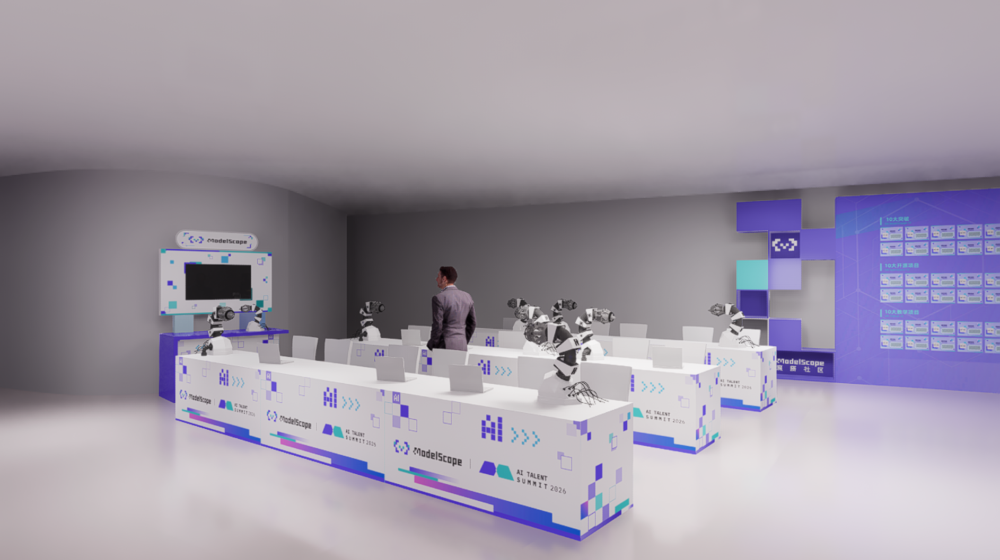

# Task 04: 总结分享

# Task 04: 总结分享

## 1. 今天要做什么

最后一天不再新增很多概念，而是把前面三天已经接触到的内容重新串起来，形成一次真正意义上的“收束”。很多学习者在专题学习结束时，会产生一种常见的错觉：好像这几天看了不少词、也点过一些平台页面，但还很难判断自己到底学到了什么。实际上，学习的最后一步从来不是再补一个新知识点，而是把已经出现过的概念和经验重新整理成结构。

因此，今天的任务可以概括成三件事：先复盘这四天到底建立了哪些认知，再判断如果继续学，下一步应该往哪里走，最后把这些理解沉淀为一个自己的具身智能应用构想。只有完成这一步，前面几天的学习才不会停留在“听说过”。

## 2. 四天学习链路回顾

到这里，你其实已经顺着一条完整主线走了一遍。第一天，你建立的是“概念层的框架”，也就是你已经知道具身智能不只是“大模型上机器人”，而是一个包含本体、智能内核和环境反馈的闭环系统。第二天，你建立的是“技术层的区分”，也就是你已经能够粗略分清 VLA 更强调从感知和语言到动作的统一映射，世界模型更强调对环境演化的预测和规划，而 RynnBrain 这类系统更强调时空记忆、空间推理和任务编排。第三天，你建立的是“工程层的直觉”，也就是你已经通过乐云平台看到数据是怎么组织的、模型是怎么被调试和调用的、一项技能如何被执行和回看。

这三层内容连在一起，才构成一个完整的入门闭环。很多初学者的问题并不是“少学了一个概念”，而是只接触到了其中一层：要么只知道行业故事，不知道模型范式；要么只知道模型缩写，不知道系统链路；要么只看了平台截图，却没有形成对任务本质的理解。你这几天学到的真正价值，正是把这三层连接起来了。

## 3. 接下来可以往哪继续

如果你学到这里觉得“有点懂了，但还不够过瘾”，后续其实可以沿三条路线继续走。第一条路线是补基础，适合还没有建立机器人学、控制和空间描述基础的同学。这类同学继续往前走时，最容易卡在坐标系、运动学、控制链路这些问题上，所以应该优先回到 [**具身智能概述**](../../01-%E5%85%B7%E8%BA%AB%E6%99%BA%E8%83%BD%E6%A6%82%E8%BF%B0/01%E5%85%B7%E8%BA%AB%E6%99%BA%E8%83%BD%E6%A6%82%E8%BF%B0.md) 和 [**机器人基础和控制、手眼协调**](../../02-%E6%9C%BA%E5%99%A8%E4%BA%BA%E5%9F%BA%E7%A1%80%E5%92%8C%E6%8E%A7%E5%88%B6%E3%80%81%E6%89%8B%E7%9C%BC%E5%8D%8F%E8%B0%83/05%E7%BB%BC%E5%90%88%E5%AE%9E%E6%88%98%E4%B8%8E%E4%BB%BF%E7%9C%9F.md) 这类章节，把本体和控制的底层逻辑补齐。

第二条路线是补模型和仿真，适合已经对概念产生兴趣，希望继续理解 VLA、数据集、仿真环境和训练流程的同学。这条路更贴近“研究和工程之间的连接层”，建议优先看 [**VLA 相关总结综述**](../../06-%E7%AD%96%E7%95%A5%E6%8A%93%E5%8F%96%E6%88%96%E6%8A%93%E5%8F%96VLA/01VLA%E7%9B%B8%E5%85%B3%E6%80%BB%E7%BB%93%E7%BB%BC%E8%BF%B0.md)、[**LIBERO 数据集**](../../09-%E5%85%B7%E8%BA%AB%E6%99%BA%E8%83%BD%E6%95%B0%E6%8D%AE%E5%8F%8A%E8%AF%84%E4%BC%B0%E5%9F%BA%E5%87%86benchmark/01-libero.md) 和 [**具身智能其他仿真工具及仿真前沿**](../../10-%E5%85%B7%E8%BA%AB%E6%99%BA%E8%83%BD%E5%85%B6%E4%BB%96%E4%BB%BF%E7%9C%9F%E5%B7%A5%E5%85%B7%E5%8F%8A%E4%BB%BF%E7%9C%9F%E5%89%8D%E6%B2%BF/README.md)。这些内容会帮助你把“模型怎么学”和“系统怎么验证”连起来。

第三条路线是真机与实操，适合想真正动手接触机械臂、开发板和遥操链路的同学。这条路线最具操作感，但也最容易遇到环境和硬件门槛，因此更适合作为专题结束后的进阶方向。对应内容可以从 [**LeRobot 双臂异构系统遥操作**](../../03-%E6%9C%BA%E5%99%A8%E4%BA%BA%E7%A1%AC%E4%BB%B6%E3%80%81lerobot%E5%8F%8A%E5%9C%B0%E7%93%9CRDK-X5%E5%BC%80%E5%8F%91%E6%9D%BF%E6%8E%A7%E5%88%B6%E6%95%99%E7%A8%8B/04LeRobot%E5%8F%8C%E8%87%82%E5%BC%82%E6%9E%84%E7%B3%BB%E7%BB%9F%E9%81%A5%E6%93%8D%E4%BD%9C.md) 和 [**RDK-X5 连接 lerobot 机械臂进行遥操作**](../../03-%E6%9C%BA%E5%99%A8%E4%BA%BA%E7%A1%AC%E4%BB%B6%E3%80%81lerobot%E5%8F%8A%E5%9C%B0%E7%93%9CRDK-X5%E5%BC%80%E5%8F%91%E6%9D%BF%E6%8E%A7%E5%88%B6%E6%95%99%E7%A8%8B/03RDK-X5%E8%BF%9E%E6%8E%A5lerobot%E6%9C%BA%E6%A2%B0%E8%87%82%E8%BF%9B%E8%A1%8C%E9%81%A5%E6%93%8D%E4%BD%9C.md) 开始。

## 4. 未来哪些场景最值得关注

这一题没有标准答案，但它也不是纯粹凭想象发挥。一个比较稳的思路，是优先从“真实需求强、重复劳动多、环境约束清晰”的场景去思考。因为在具身智能还远未全面成熟的阶段，最先爆发的往往不是最浪漫的场景，而是那些任务边界比较清楚、劳动成本高、自动化收益显著的场景。

从这个角度看，工业制造、物流仓储、家庭服务和特种作业，仍然是最值得持续关注的方向。工业制造中的装配、分拣、搬运和质检天然具有高重复性；物流仓储中的拣货、转运和上架对效率要求非常明确；家庭服务中的收纳、递送、清洁和辅助照护则直接连接了大众对“机器人进入生活”的想象；而巡检、勘探、危险环境替代等特种作业，则体现了具身智能在高风险场景下的独特价值。

## 5. 最后的产出：应用构想书

请提交一份《我的具身智能应用构想书》。这份构想书不需要写得宏大，也不需要把所有技术细节一次讲全，关键是把逻辑说清楚。最好的写法不是堆几个名词，而是把“场景、角色、技能、价值”这四个问题真正串起来。

你可以先从场景开始，也就是先回答“在哪里使用”。这个场景可以是养老院、工厂产线、家庭厨房，也可以是商超仓库，只要它是一个你能说清楚边界的具体空间。接下来再写角色，也就是系统最终采用什么形态的机器人，是双足人形、轮式机械臂、固定式协作机械臂，还是小型巡检无人车。第三步写技能，也就是这个机器人到底要学会什么，是识别物体、多步抓取与放置、避障导航，还是根据语言指令执行复合任务。最后再写价值，也就是这个方案为什么值得做，是为了节省人力、降低危险、提高稳定性，还是提升服务体验。

如果这四部分之间能自然对应起来，那么这份构想书就已经具备了一个很重要的品质：它不再只是“觉得机器人很厉害”，而是在认真思考“什么样的任务适合什么样的系统去解决”。

## 6. 一个简短示例

> 场景：养老院晚间送药  
角色：轮式移动底盘 + 小型机械臂  
技能：识别药盒、导航到房间、确认对象、完成递送并记录状态  
价值：减轻护理人员重复劳动，提高夜间服务效率

## 7. 本专题结束后，你至少应该带走什么

如果这四天学完，你至少应该带走三层收获。第一层是问题意识，也就是你知道具身智能的基本问题到底是什么；第二层是技术判断，也就是你知道 VLA 和世界模型为什么会被高频讨论，它们分别在解决什么问题；第三层是工程直觉，也就是你知道一条从数据到技能的基本工程链路长什么样。拥有这三层收获之后，你就已经不再处于“只听过几个热词”的状态了，而是真正走进了这个方向。

**8. 一个彩蛋**🎁

学完课程，想“真机玩一玩”？恰好你又在南京！

3月22日，南京建邺 · 国际青年会议中心，DAMO开发者矩阵将在互动交流市集举办机械臂真机体验，名额有限，先到先得~

报名链接：[https://developer.damo-academy.com/activity/detail/32026031317733911743293071](https://developer.damo-academy.com/activity/detail/32026031317733911743293071)

展区示意效果（请以实际为准）
